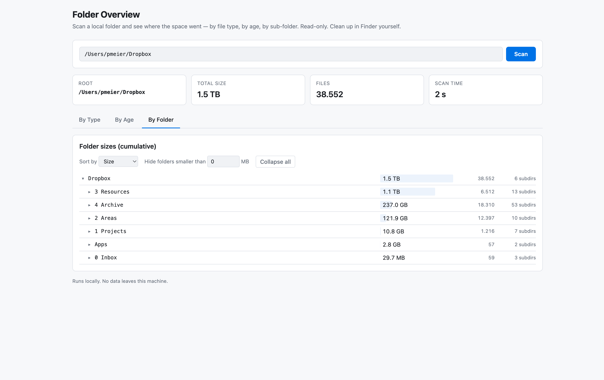

# Folder Overview



Local web dashboard that scans any folder on disk and shows you where the
space went. Built with [Bun](https://bun.sh/) on the server side and React on
the client side.

Three views over a single scan:

- **By Type** — total bytes per file extension, so you can immediately see
  whether videos, photos, or something else dominate.
- **By Age** — bytes grouped by the year each file was last modified, with
  the biggest files per year one click away.
- **By Folder** — a collapsible tree of folders with cumulative sizes.
  Useful when e.g. a video-course folder contains many individual files that
  you want to see aggregated as one row.

The tool is read-only. Nothing gets deleted or moved. Clean up in your file
manager afterwards.

## Requirements

- [Bun](https://bun.sh/) ≥ 1.1 (the server runs on Bun, not Node).

## Install

```bash
bun install
```

## Run (production-style)

Build the React app once, then start the Bun server which serves the built
assets together with the scan API:

```bash
bun run build
bun run start
```

Open <http://127.0.0.1:5174>.

## Run (dev)

Two processes: Vite for HMR on the UI, Bun `--hot` for the API.

```bash
bun run dev
```

UI on <http://localhost:5173> (with `/api` proxied to the Bun server on
`5174`).

## Usage

1. Paste an absolute folder path into the text field (e.g. `/Users/you/Dropbox`).
2. Hit **Scan**.
3. Watch the progress bar. The UI updates roughly 4×/s while the walker runs.
4. Switch between the three tabs to explore the result.

Scans are in-memory only — they disappear when the server stops.

## How it works

- Single-process `Bun.serve` (no Express).
- The scanner walks the tree iteratively with `node:fs/promises` `readdir` +
  `lstat`, does **not** follow symlinks (so symlinked cloud-storage mounts
  don't cause loops or double-counts).
- Progress is streamed to the browser with Server-Sent Events.
- The server keeps the raw file list in memory; the browser only ever sees
  aggregates and a top-N drilldown per category, so the payload stays small
  even for hundreds of thousands of files.

## Configuration

| Env var              | Default | What it does                                 |
|----------------------|---------|----------------------------------------------|
| `SERVER_PORT`        | `5174`  | Port the Bun server binds to (`127.0.0.1`).  |
| `VITE_DEFAULT_PATH`  | *none*  | Pre-fills the path input in the UI.          |

## License

MIT.
